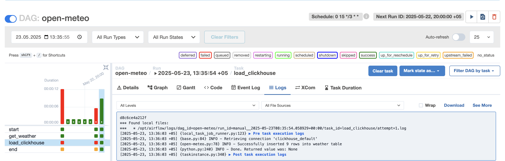
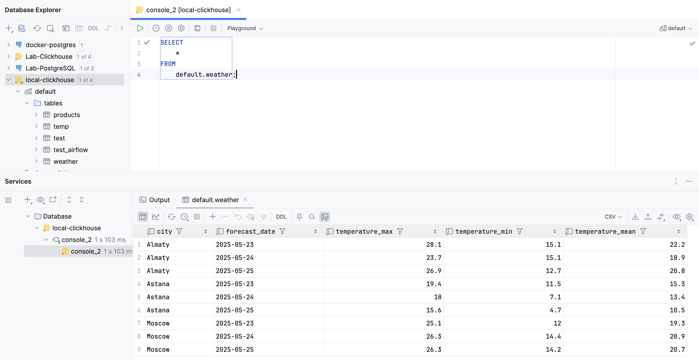

# Weather Forecast ETL with Airflow & ClickHouse

## Описание
Автоматический ETL-пайплайн, который каждые 3 дня собирает прогноз погоды из Open-Meteo API по трем городам (Москва, Астана, Алматы) и сохраняет данные в ClickHouse для дальнейшего анализа.

## Технологии
- **Apache Airflow** — для автоматизации ETL
- **Requests** — для обращения к REST API
- **Pandas** — для трансформации данных
- **ClickHouse** — как хранилище
- **clickhouse-connect** — Python-клиент для ClickHouse

## Архитектура
1. DAG запускается по расписанию: каждые 3 дня в 15:00
2. **get_weather**:
   - Делает GET-запрос к Open-Meteo API
   - Извлекает daily данные: max, min и mean температуру
   - Сохраняет в CSV файл `/tmp/weather.csv`
3. **load_clickhouse**:
   - Создаёт таблицу в ClickHouse (если не существует)
   - Читает CSV, приводит даты к нужному формату
   - Загружает данные в ClickHouse

## Структура ClickHouse таблицы

| Поле              | Тип       |
|-------------------|-----------|
| city              | String    |
| forecast_date     | Date      |
| temperature_max   | Float32   |
| temperature_min   | Float32   |
| temperature_mean  | Float32   |

## Настройка

1. Установи зависимости:
```pip install pandas requests clickhouse-connect apache-airflow```

2. Создай подключение ClickHouse в Airflow Admin → Connections:
- **Conn Id**: `clickhouse_default`
- **Conn Type**: HTTP
- **Host, Port, Login, Password** — укажи свои данные

3. Помести DAG в папку `/dags`
4. Запусти Airflow:
```airflow webserver & airflow scheduler```
5. Проверь в UI: [http://localhost:8080](http://localhost:8080)

## Пример DAG расписания
```0 15 */3 * *```

→ каждый 3-й день в 15:00 по UTC

## Пример строки данных

| city   | forecast_date | temperature_max | temperature_min | temperature_mean |
|--------|---------------|-----------------|-----------------|------------------|
| Almaty | 2025-05-23    | 28.1            | 15.1            | 22.2             |

## Результаты

  

