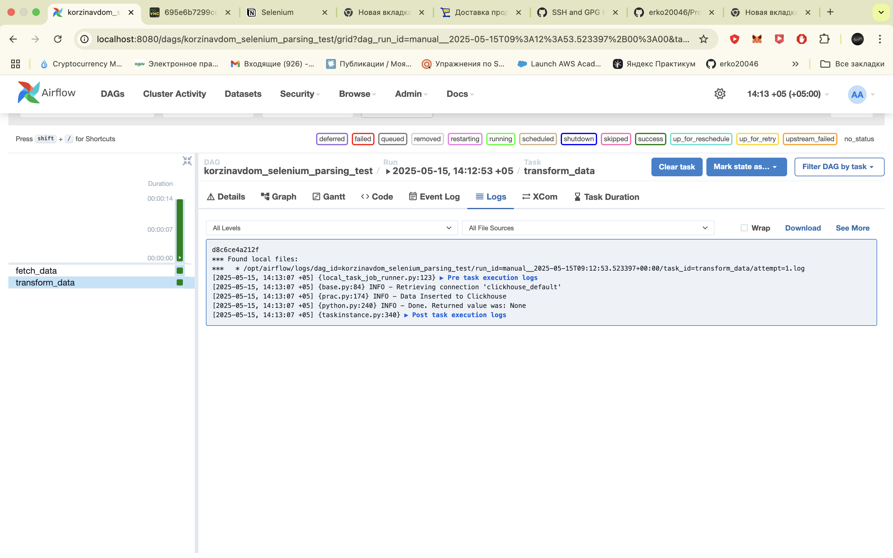
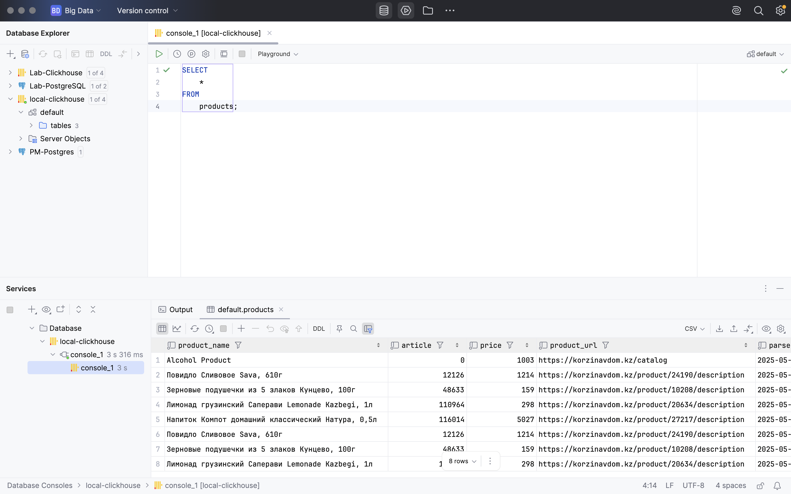
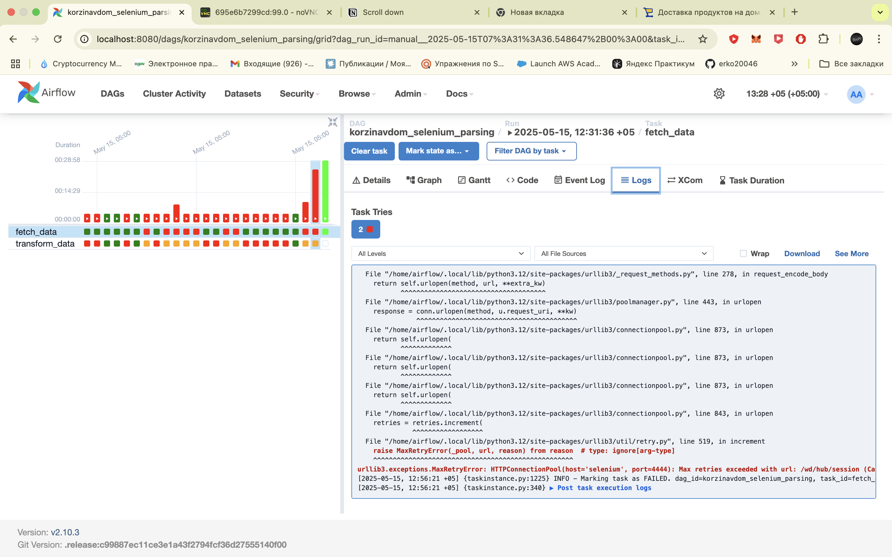
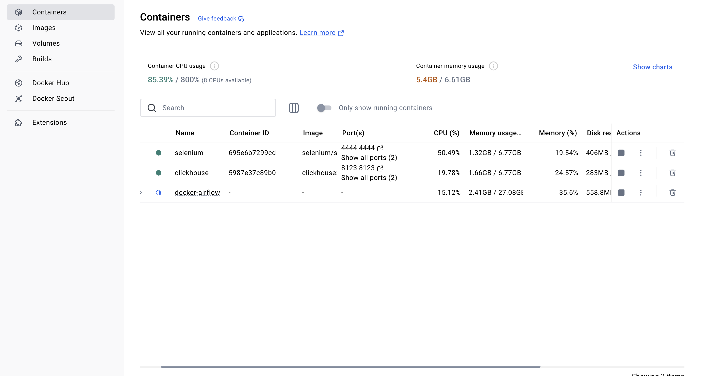

# Ежедневный парсинг сайта korzinavdom.kz

## Описание проекта

Цель проекта — автоматизация парсинга интернет-магазина [korzinavdom.kz/catalog](https://korzinavdom.kz/catalog), с сохранением данных в ClickHouse и управлением процессом через Apache Airflow. Проект реализован в виде DAG, запускаемого ежедневно.

---

## Используемые технологии

- **Python 3.12**
- **Apache Airflow** — оркестрация DAG
- **Selenium + Firefox Remote** — парсинг динамического контента
- **ClickHouse** — хранилище данных
- **clickhouse-connect** — библиотека вставки данных
- **pandas** — формирование таблиц
- **Docker (Selenium Grid)** — поддержка headless-браузера

---

## Периодичность запуска

- DAG запускается **ежедневно в 00:00 (полночь)**
- Настроен через `schedule_interval='@daily'` в Airflow

---

## Что делает DAG

### Шаг 1: `fetch_data`

- Открывает сайт [korzinavdom.kz/catalog](https://korzinavdom.kz/catalog)
- Скроллит до конца страницы, чтобы подгрузить все товары
- Обходит **все карточки товаров**
- Извлекает данные:
  - `product_name` — наименование товара
  - `article` — артикул (внутри карточки)
  - `price` — цена в тенге
  - `product_url` — ссылка на карточку товара
  - `parsed_at` — дата и время парсинга
- Обрабатывает модальное окно 21+ (если появляется)
- Сохраняет результат во временный CSV:  
  `/tmp/tmp_parsed_data.csv`

### Шаг 2: `transform_data`

- Загружает данные из временного файла
- Очищает цену от символов `₸` и пробелов
- Преобразует цену в целое число (`int`)
- Подключается к ClickHouse через `BaseHook`
- Создаёт таблицу `products`, если ещё не существует
- Выполняет `INSERT INTO` текущих строк

---

## Структура таблицы в ClickHouse

```sql
CREATE TABLE IF NOT EXISTS products (
    product_name String,
    article      UInt64,
    price        UInt64,
    product_url  String,
    parsed_at    DateTime
)
ENGINE = MergeTree
ORDER BY (article) 
```

--- 


### Тестирование

Так как моя машина (macOS) ограничена по ресурсам, я запускал облегченную версию DAG-а:
dag/korzinavdom_selenium_parsing_test.py — с ограничением на ~8 карточек.

Если у вас более производительная машина или сервер, рекомендую запускать основной DAG:
korzinavdom_selenium_parsing.py, который обходит весь каталог.

⸻

### Результаты

### Успешный запуск тестового DAG

Для тестирования я использовал облегчённую версию DAG:  
`dag/korzinavdom_selenium_parsing_test.py`, которая обходит ~8 карточек.

- DAG успешно отработал в Apache Airflow:



---

### Данные в ClickHouse

- Скриншот строк, которые были вставлены в ClickHouse — просмотр через DataGrip:



---

### Ошибка запуска основного DAG

Я пытался запустить основной DAG `korzinavdom_selenium_parsing.py`, который парсит весь каталог товаров , но на моём Mac возникла ошибка, связанная с нехваткой ресурсов Docker и памяти:

- Ошибка исполнения основного DAG:



- Состояние Docker ресурсов (ограничение памяти):



---

Если у вас более мощная машина или вы работаете на сервере — вы можете запускать основной DAG без ограничений.
